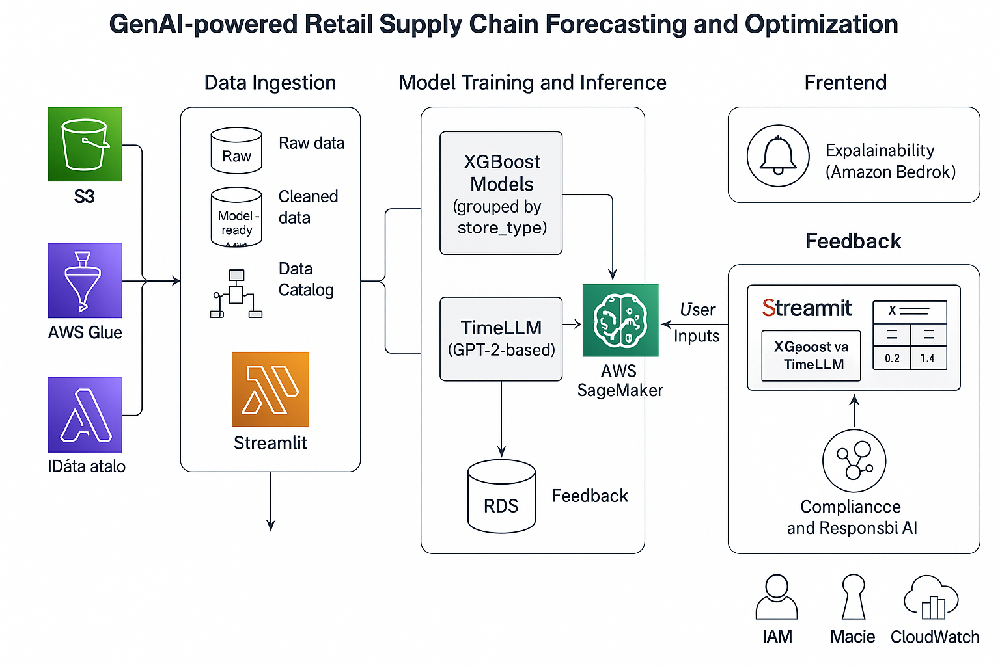

# GenAI-Powered Retail Forecasting with AWS and TimeLLM

A full-stack, cloud-native forecasting system designed to optimize retail supply chain planning using both traditional ML (XGBoost) and Generative AI (TimeLLM). Built with a modern AWS-based architecture and production-grade data engineering pipelines, the solution delivers scalable, explainable, and interactive weekly sales forecasts.

---

## 🌟 Project Highlights

- 🔹 Accurate time series forecasting using GPT2-based **TimeLLM**
- 🔹 Traditional ML fallback with **XGBoost** grouped by store type
- 🔹 End-to-end ETL pipelines with **AWS Glue**, **Athena**, and **S3**
- 🔹 Secure and scalable backend with **FastAPI**, **Lambda**, and **RDS**
- 🔹 Frontend visualization via **Streamlit** with voice I/O and explainability
- 🔹 Deployed on **AWS Elastic Beanstalk** for seamless web access

---

## 🔧 Tech Stack

| Layer             | Tools Used                                                                 |
|------------------|------------------------------------------------------------------------------|
| Data Engineering | AWS Glue, Amazon S3, Athena, Parquet, PyArrow                                |
| ML Models        | XGBoost (by store_type), TimeLLM (GPT2-based custom model)                  |
| Cloud & Compute  | SageMaker, Lambda, Elastic Beanstalk, RDS, IAM           |
| Frontend         | Streamlit (voice-enabled), Bedrock (for explainability), FastAPI (backend)  |
| Languages        | Python, SQL                                                                  |

---

## 🧠 Why This Project?

Retail companies face high costs due to inaccurate forecasting. This solution demonstrates how **Data Engineering + GenAI** can be used to build a responsive, secure, and transparent forecasting system for real-world supply chain use cases.

---

## 📐 Architecture Overview




## 🔒 Model Access & AWS Dependency

This repository does **not include trained model weights** or SageMaker configurations due to:
- Model size and compute dependencies
- Secure deployment on a private AWS account

To use or extend this project, you will need:
- An active AWS account
- Access to deploy models to **Amazon SageMaker**
- IAM roles for access to S3, Glue, Athena, Lambda, and RDS

## 🗂️ Project Structure
```bash
├── inference/ # ML inference scripts (XGBoost, TimeLLM)
├── models/ # Model definitions (no weights)
├── streamlit_app/ # Streamlit frontend UI
├── infra/ # AWS deployment templates
├── glue_jobs/ # Glue scripts for ETL
├── data_specs/ # Sample schema and formats
├── requirements.txt
└── README.md
```
###
## ⚙️ Setup Instructions

### 1. Clone and Install
```bash
git clone https://github.com/your-username/genai-retail-forecasting.git
cd genai-retail-forecasting
pip install -r requirements.txt

streamlit run streamlit_app/Home.py

⚠️ Local version will not show actual forecasts unless connected to AWS endpoints.
```

☁️ AWS Deployment (Overview)
Frontend (Elastic Beanstalk)
Package Streamlit app (application.py, requirements.txt)

Deploy on Python environment via Elastic Beanstalk Console


Models (SageMaker)
Upload trained models to S3

Deploy TimeLLM and XGBoost as SageMaker endpoints

Secure with IAM roles and trigger via FastAPI or Lambda

Data Pipeline
Configure Glue jobs and crawlers to transform and catalog data

Partition model-ready datasets in S3

Query with Athena during inference

Accomplishments
Fully working GenAI + ML forecasting system for retail

Real-time data engineering and prediction pipeline

Multi-model comparison (GenAI vs traditional ML)

Clean AWS deployment architecture for enterprise use

🧪 Next Steps
Fine-tune TimeLLM on domain-specific time series

Add real-time alerts and inventory signals

Integrate user feedback loops for continuous model improvement

Publish reusable deployment templates (CloudFormation / CDK)


Author
Jinen Modi
Data Engineer | GenAI | Cloud & MLOps
